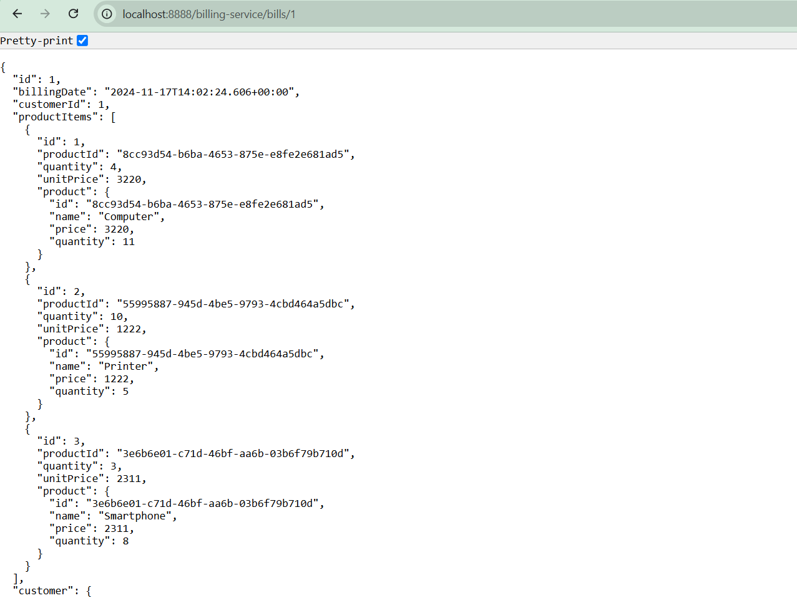

# E-Commerce Microservices Architecture

This repository contains a microservices-based e-commerce application built with Spring Boot and Spring Cloud. The architecture is designed to handle various aspects of an e-commerce platform, including customer management, inventory, billing, and more.

---

## Table of Contents

1. [Introduction](#introduction)
2. [Architecture Overview](#architecture-overview)
3. [Technologies Used](#technologies-used)
4. [Microservices](#microservices)
5. [Getting Started](#getting-started)
6. [Folder Structure](#folder-structure)
7. [Preview](#preview)


---

## Introduction

This project demonstrates the implementation of an e-commerce system using a **microservices architecture**. Each service is responsible for a specific domain and communicates with other services via REST APIs or messaging.

---

## Architecture Overview

  


### Key Features:
- Decoupled services for scalability.
- Centralized configuration and service discovery.
- API Gateway for unified client access.
- Database per service for data sovereignty.

---

## Technologies Used

- **Spring Boot**: Microservice framework.
- **Spring Cloud**: For service discovery, configuration, and API Gateway.
- **Hibernate/JPA**: ORM for database interaction.
- **Feign**: For inter-service communication.
- **H2 Database**: Databases for persistent storage.
- **Eureka**: Service discovery and registry.
- **Maven**: Build tool for dependency management.

---

## Microservices

### 1. Billing Service
- Manages billing and payment processing.
- Endpoints for creating invoices and processing payments.

### 2. Config Service
- Centralized configuration management for all services.
- Uses Spring Cloud Config.

### 3. Customer Service
- Handles customer data and operations.
- Provides APIs for CRUD operations on customers.

### 4. Discovery Service
- Service registry using Eureka.
- Facilitates dynamic service discovery.

### 5. Gateway Service
- Acts as an API Gateway for routing client requests.
- Handles cross-cutting concerns like security and rate limiting.

### 6. Inventory Service
- Manages product inventory and stock levels.
- Provides APIs to update and query stock information.

---

## Getting Started

### Prerequisites
- Java 17 or later
- Maven
- H2 Database
- Docker (optional, for containerization)

### Steps to Run
1. Clone the repository:
   ```bash
   git clone https://github.com/your-repo-name/e-com-architecture-micro-services.git```

## Folder Structure

```plaintext
.
├───billing-service          # Handles billing and payment processing
│   ├───src
│   │   ├───main
│   │   │   ├───java/com/example/billingservice
│   │   │   │   ├───entities       # Domain models
│   │   │   │   ├───repository     # Database repositories
│   │   │   │   ├───feign          # Feign clients for inter-service communication
│   │   │   │   └───web            # REST controllers
│   │   │   └───resources
│   │   │       ├───static         # Static web resources
│   │   │       └───templates      # HTML templates (if applicable)
│   └───target                    # Compiled code and build artifacts
│
├───config-repo              # Stores externalized configuration files for services
│
├───config-service           # Centralized configuration service
│   ├───src
│   │   ├───main
│   │   │   ├───java/com/example/configservice
│   │   │   └───resources
│   └───target
│
├───customer-service         # Manages customer-related operations
│   ├───src
│   │   ├───main
│   │   │   ├───java/com/example/customerservice
│   │   │   │   ├───entities       # Customer models
│   │   │   │   ├───repository     # Repositories for customer data
│   │   │   │   ├───config         # Service-specific configurations
│   │   │   └───resources
│   │   │       ├───static
│   │   │       └───templates
│   └───target
│
├───discovery-service        # Eureka service registry for dynamic discovery
│   ├───src
│   │   ├───main
│   │   │   ├───java/com/example/discoveryservice
│   │   │   └───resources
│   └───target
│
├───gateway-service          # API Gateway to route requests
│   ├───src
│   │   ├───main
│   │   │   ├───java/com/example/gatewayservice
│   │   │   └───resources
│   └───target
│
├───inventory-service        # Manages product inventory
│   ├───src
│   │   ├───main
│   │   │   ├───java/com/example/inventoryservice
│   │   │   │   ├───entities       # Inventory models
│   │   │   │   ├───repository     # Repositories for inventory data
│   │   │   │   ├───config         # Inventory configurations
│   │   │   └───resources
│   │   │       ├───static
│   │   │       └───templates
│   └───target
│
├───imgs                     # Stores images for documentation
└───README.md                # Project documentation
```
## Preview





